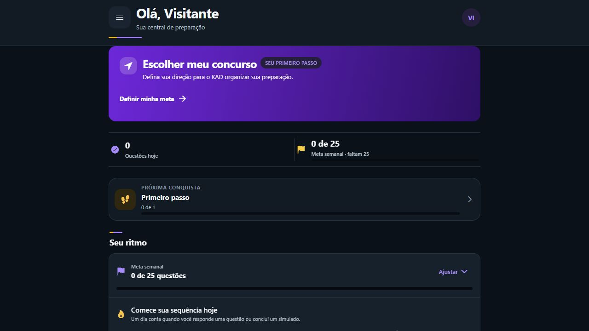
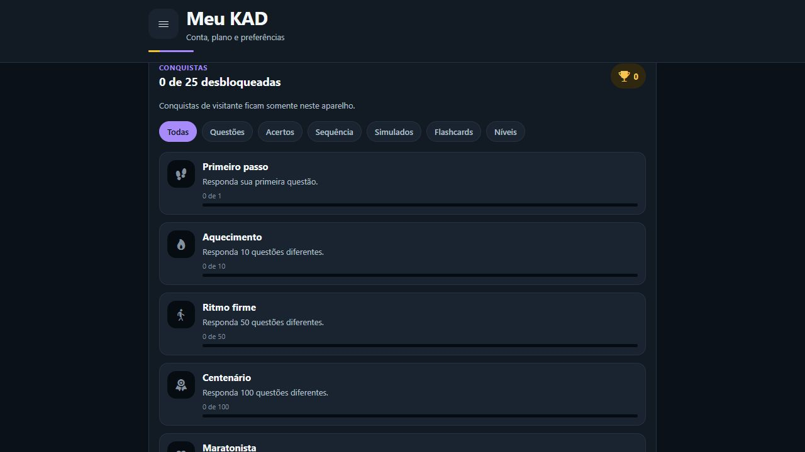
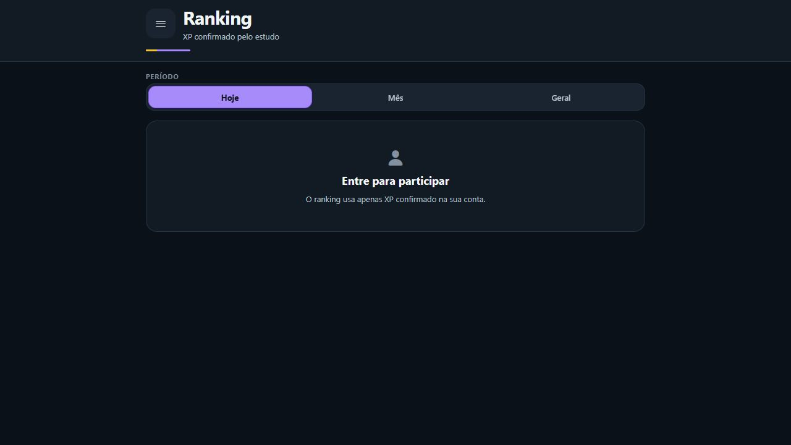

# Evidências de gamificação — 2026-09-06

## Validação local

- `npm test`: 480 testes aprovados, sem falhas, pulos ou cancelamentos.
- `npm run typecheck`: aprovado.
- `npm run lint`: aprovado.
- `npm --prefix site run check`: 76 testes aprovados, tipagem e build aprovados.
- Migration executada em PostgreSQL isolado por meio dos testes PGlite.
- `git diff --check`: aprovado.
- Consultores de segurança e desempenho do ambiente atual foram lidos como linha de base. A migration nova não foi aplicada ao projeto remoto.

Os testes cobrem, entre outros casos: 999/1.000 questões, primeira resposta válida, questão repetida, retirada ou inexistente, alternativa inválida, simulado com perguntas duplicadas, reenvio, isolamento, acesso anônimo, opt-in, desempate, virada de mês, fila offline, confirmação tardia, troca de conta, estados de tela, acessibilidade e movimento reduzido.

## Capturas

### Próxima conquista na página inicial

### Galeria e filtros no perfil

### Ranking privado sem dados fictícios

As capturas foram feitas na versão web local, em modo visitante e sem credenciais de produção. A galeria autenticada e o ranking populado dependem da migration no ambiente de homologação.
