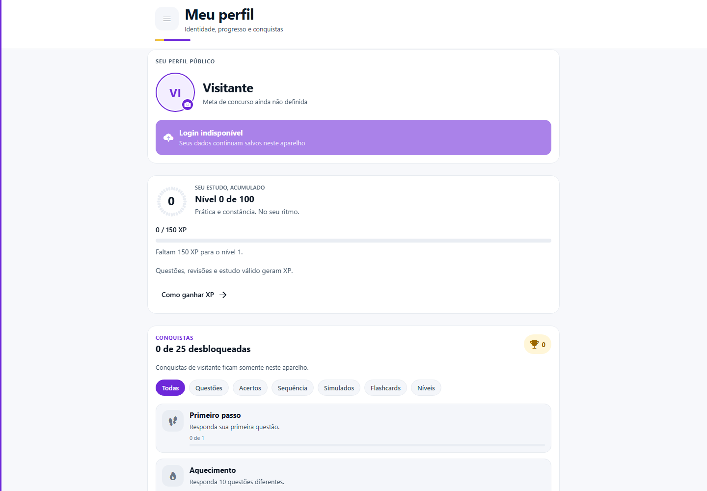
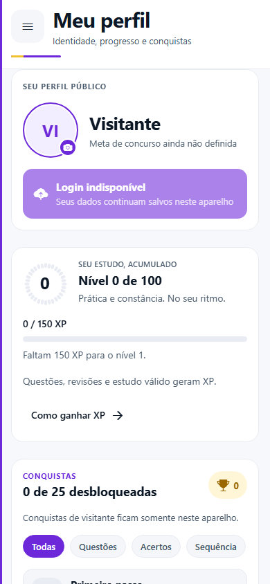
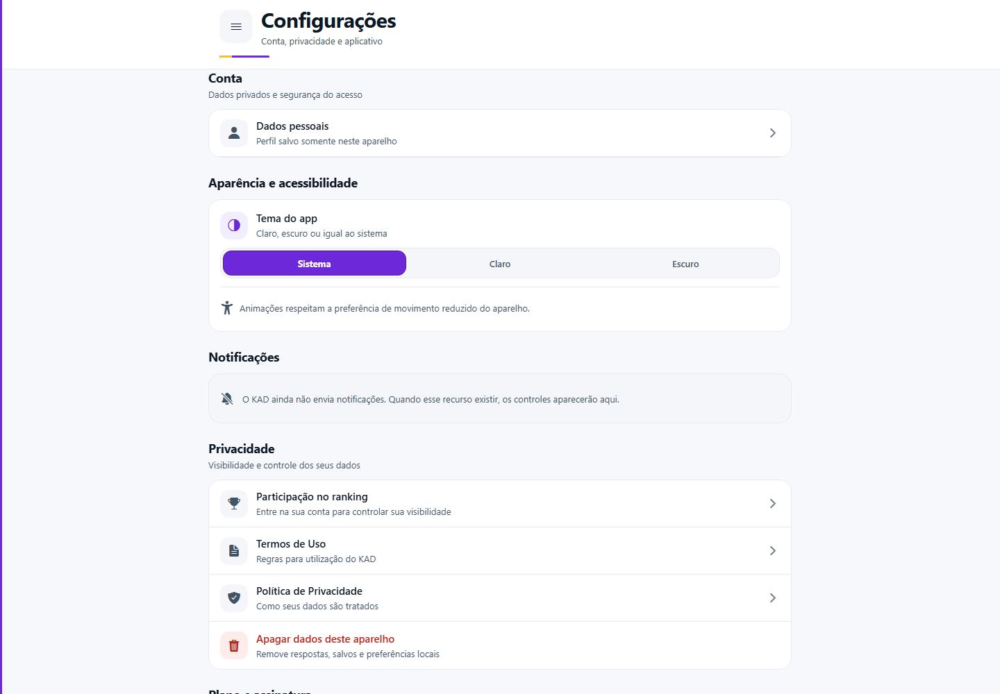
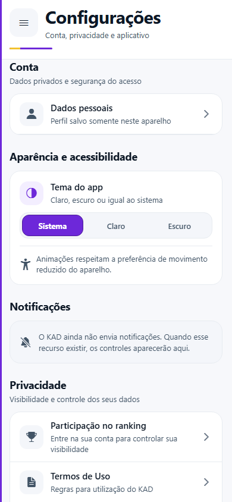

# Validação — Perfil e Configurações

Data: 06/09/2026

## Escopo

- Perfil concentrado em identidade pública, meta, progresso, nível, XP, conquistas e posição no ranking.
- Configurações criada como rota canônica para conta, aparência, acessibilidade, notificações, privacidade, assinatura, ajuda e sessão.
- Configurações adicionada ao menu principal logo após Perfil.
- Preferência de participação no ranking movida para Configurações, com leitura e gravação remotas já existentes.
- Ações sensíveis continuam usando os fluxos existentes de confirmação, exclusão, redefinição e encerramento de sessão.
- Nenhuma migração, alteração de credencial ou mudança de produção foi realizada.

## Resultado da validação

| Cenário | Resultado |
| --- | --- |
| Navegação por menu e atalho do Perfil | Aprovado |
| Perfil de visitante | Aprovado |
| Configurações de visitante | Aprovado |
| Tema claro, escuro e sistema | Aprovado |
| Estado honesto de notificações indisponíveis | Aprovado |
| Privacidade e participação no ranking | Coberto por testes; exige sessão para alterar |
| Plano, ajuda, dados locais e saída | Aprovado |
| Layout web desktop (1440 × 1000) | Aprovado |
| Layout móvel (390 × 844) | Aprovado, sem corte horizontal |

## Evidências visuais

### Perfil

### Configurações

## Verificações automatizadas

- `npm run check`
- `npx expo export --platform web`
- testes específicos de navegação, autenticação, privacidade, exclusão local, ranking, gamificação e separação entre Perfil e Configurações
