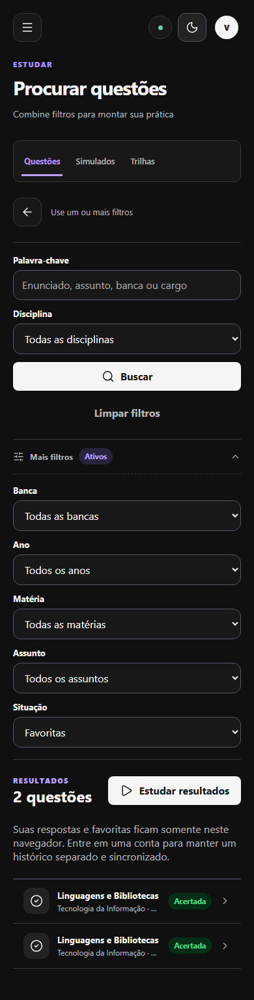
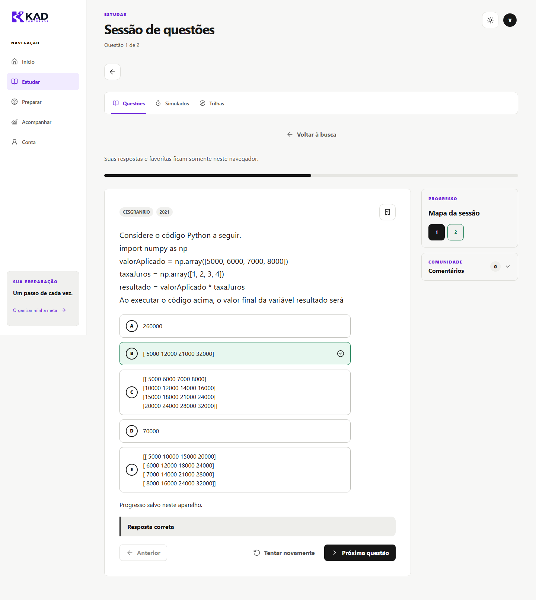

# Busca e estudo visitante — 07/10/2026

A jornada foi executada no KAD Site com o catálogo publicado da homologação
`npaoyezfwmgauirrlyog`, pela consulta normal de `questions` com
`publication_status=published`. A consulta retornou dez questões oficiais
BB/Cesgranrio 2021. `VITE_KAD_LOCAL_PILOT` ficou desativado.

Prévia local: http://127.0.0.1:5200/questoes/buscar. Depende do servidor local
em execução. Branch `codex/site-guest-study`, baseada em `origin/main`
`b388ac8ad7c00b80d56fab202c9dd41493164f66`. O checkout principal sujo foi preservado.

## Defeitos corrigidos

- Matéria não participava do filtro; ano era descartado ao iniciar a sessão.
- A busca não oferecia ano, matéria, assunto, respondidas ou favoritas.
- Uma frase digitada com espaços não encontrava o texto atravessando quebras
  de linha do PDF. A normalização agora vale apenas para a comparação; o
  enunciado exibido permanece intacto.
- Abrir um resultado criava uma sessão isolada daquele item. Agora abre sua
  posição no conjunto filtrado, permite anterior/próxima e retorna aos filtros.
- A revisão sem `tipo` tinha título de favoritas e conteúdo de acertadas.
- O catálogo vazio dizia que o banco estava pronto. Carregamento e falha agora
  bloqueiam a listagem, sem apresentar exemplos como conteúdo publicado, e a
  falha oferece nova tentativa.
- A listagem escondia itens depois dos primeiros 40 sem oferecer acesso a eles.
  Os resultados do catálogo carregado ficam acessíveis.
- O visitante recebe aviso explícito sobre respostas e favoritas neste
  navegador; o botão de sincronização aparece apenas para contas autenticadas.

O snapshot de sessão existente foi mantido: responder uma questão não a remove
antes de mostrar a correção, mesmo no filtro de não respondidas. Armazenamento
e separação entre proprietários continuam usando o fluxo existente.

## Conteúdo publicado versus aprovado

Referência: exportação oficial `staging-after-approval/questoes.jsonl`, SHA256
`5691ba0be978e6659879fd19c4db1db25a0606aad2aed7561e137e3c271054ac`.
Comparação exata de enunciado, alternativas (ID e texto), gabarito, banca, ano,
disciplina, matéria e assunto. Os hashes dessa projeção e IDs completos estão
em [guest-study-evidence/report.json](guest-study-evidence/report.json).

| Questão original | Comparação | Uso na jornada |
| --- | --- | --- |
| 18 | Enunciado diferente | Somente busca e comparação |
| 21 | Alternativas diferentes | Somente busca e comparação |
| 36 | Enunciado diferente | Somente busca e comparação |
| 42 | Campos comparados coincidem | Resposta errada; correção C; revisão e navegação |
| 44 | Campos comparados coincidem | Resposta B; favorita; persistência; celular |
| 45 | Enunciado e alternativas diferentes | Somente busca e comparação |
| 53 | Campos comparados coincidem | Resposta B e favorita com conexão desligada |
| 64 | Campos comparados coincidem | Somente busca e comparação |
| 68 | Campos comparados coincidem | Somente busca e comparação |
| 69 | Enunciado diferente | Somente busca e comparação |

Os dez gabaritos coincidem. **Cinco questões têm diferenças de conteúdo.**
Nenhum registro remoto foi substituído, importado ou publicado. A atualização
editorial desses cinco itens continua pendente em outra atividade autorizada.
A jornada funcional não equivale à aprovação das versões antigas.

## Validação

| Execução | Resultado |
| --- | --- |
| `npm run check` na raiz | 492 testes, tipos e lint aprovados |
| `npm --prefix site run check` | 91 testes, tipos e build aprovados |
| `npm run lint` após as mudanças finais | Aprovado |
| `node --check site/scripts/guest-study-browser.mjs` | Aprovado |
| `git diff --check` | Aprovado |
| Jornada Chromium com catálogo real | 13 grupos de verificações aprovados |

As regressões de filtros, sessão, revisão e busca entre linhas falharam antes
das respectivas correções. Testes unitários usam fixtures; não contam como
prova de integração real.

No navegador: filtros combinados e opções derivadas das dez questões; todos
os estados de resposta; favoritas; filtro vazio e busca sem resultado; limpeza;
clique duplo na resposta; correção sem desaparecer; anterior/próxima; retorno
à busca e à revisão; recarregamento; fechamento e reabertura de aba com
histórico preservado. Enunciado e alternativas exibidos foram comparados
literalmente ao catálogo para os três itens estudados.

Também foram testados responder, favoritar e navegar depois de desligar a rede
do contexto de teste, com catálogo já carregado; reconectar e recarregar
preservou os registros. A rede da máquina não foi alterada.

Larguras 1440, 1024, 768 e 390 px, temas claro e escuro, movimento reduzido e
foco por teclado. Sem rolagem horizontal. No celular, responder novamente e
remover/adicionar favorita passaram nos dois temas. Exemplos:




Falha inicial, atraso de resposta e catálogo vazio foram **simulados** por
interceptação. A nova tentativa voltou à resposta real da homologação. O
isolamento visitante/conta foi validado com armazenamento local de teste, sem
efetuar login real. Nenhuma mutação remota, chamada à produção ou erro de página
foi registrado pelo roteiro.

## Reprodução e limites

Com a prévia local configurada para homologação e o Playwright disponível:

```text
KAD_TEST_URL=http://127.0.0.1:5200
KAD_APPROVED_PACKAGE=<caminho do JSONL aprovado>
KAD_TEST_OUTPUT=<diretório de evidências fora dos dados do usuário>
PLAYWRIGHT_MODULE_PATH=<caminho do index.mjs do Playwright, se externo>
node site/scripts/guest-study-browser.mjs
```

O roteiro usa um contexto Chromium novo e recusa requisições a outros hosts e
escritas remotas. Não usa credenciais administrativas, dados demonstrativos ou
pacote local para alimentar a tela. O pacote aprovado serve só para comparação.

O catálogo não é armazenado para iniciar o site completamente sem internet;
o modo sem conexão validado começa depois do carregamento. Registros locais
dependem da mesma origem/navegador e da conservação dos dados do navegador.
Não foram testados aparelhos físicos, Safari ou Firefox. O build mantém o aviso
de bundle maior que 500 kB e de `VITE_SITE_URL` ausente na prévia local.
